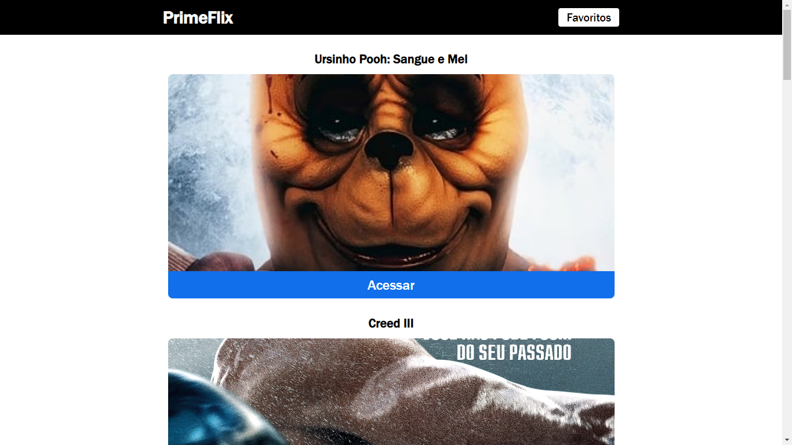

# Prime-flix-65
 

 
    
    

Um programa feito com React JS e React Routes para exibir lista de filmes, informações como avaliações, trailer e mais sobre filmes. Ele usa os dados da API do TheMovieDB.
 
Deploy: https://primeflix65.netlify.app

## Instalação
Para instalar o programa, siga estas etapas: 

1- Clone o repositório para sua máquina local. 
2- Instale as dependências com npm install. 
3- Execute o programa com npm start. 

## Como usar
Para usar o programa, abra-o em um navegador e navegue pelas diferentes páginas para ver informações sobre os filmes.

## API
O programa usa a API do TheMovieDB para obter informações sobre os filmes.

## Estrutura do projeto
Os arquivos principais do projeto estão localizados na pasta "src". O arquivo App.js contém a lógica principal do programa, enquanto os componentes individuais estão localizados na pasta "components".

## Contribuição
Contribuições são bem-vindas! Sinta-se à vontade para enviar pull requests com correções de bugs, novos recursos ou melhorias na documentação.

Com base nas informações acima, o README.md para o projeto "Prime-flix-65" está completo. É importante lembrar que cada projeto pode ter requisitos diferentes e pode ser necessário adicionar informações adicionais ao README.md, dependendo das necessidades específicas do projeto.
